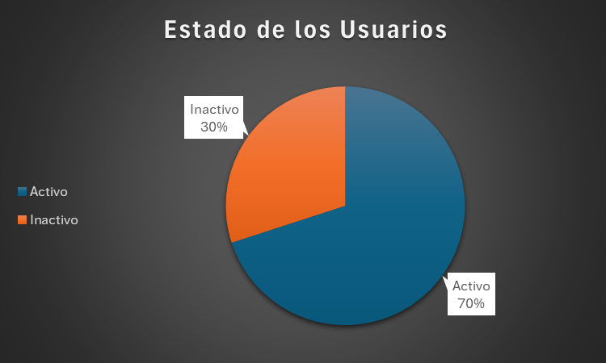
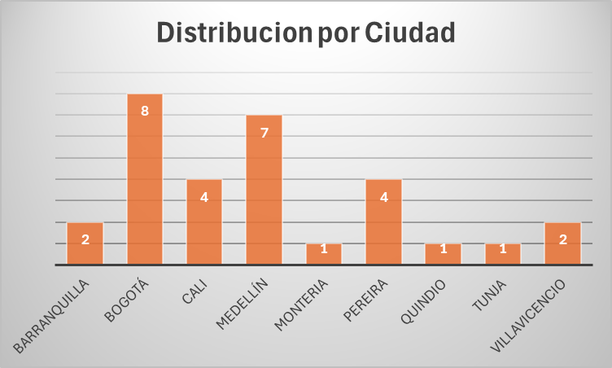

#  Proyecto de Data Entry – Gestión de Usuarios

##  Sobre mí
Soy especialista en **Data Entry** con experiencia en la organización, depuración y análisis de información.  
Este proyecto demuestra mi capacidad para manejar bases de datos, mantener la información precisa y generar reportes claros y visuales que facilitan la toma de decisiones.

---

##  Descripción del Proyecto
Este proyecto consiste en la recolección, organización y análisis de datos de una base de **30 usuarios**.  
La información fue ingresada y gestionada en un archivo Excel, incluyendo:

- **Nombre completo**  
- **Correo electrónico**  
- **Teléfono**  
- **Ciudad**  
- **Estado (Activo/Inactivo)**  

**Objetivo:** Mostrar habilidades en **entrada de datos, limpieza de información y generación de reportes básicos**.

---

##  Habilidades demostradas
- Manejo avanzado de **Excel**: tablas, tablas dinámicas y gráficos.  
- **Limpieza y estandarización de datos** (correos, teléfonos y nombres).  
- **Organización de bases de datos** pequeñas y medianas.  
- **Análisis básico** y presentación visual de información.  
- Atención al detalle y precisión en el ingreso de datos.

---

##  Estadísticas Generales

| Métrica                 | Valor  |
|--------------------------|--------|
| Total de usuarios        | 30     |
| Usuarios Activos         | 22     |
| Usuarios Inactivos       | 8      |
| % de usuarios activos    | 73.3%  |
| % de usuarios inactivos  | 26.7%  |

---

##  Distribución por Ciudad

| Ciudad        | Cantidad de Usuarios |
|---------------|-------------------|
| Bogotá        | 8                 |
| Medellín      | 7                 |
| Cali          | 4                 |
| Pereira       | 3                 |
| Villavicencio | 2                 |
| Barranquilla  | 2                 |
| Quindio       | 1                 |
| Tunja         | 1                 |
| Montería      | 1                 |

---

##  Ejemplo de Datos Registrados
**Tabla de usuarios con detalles reales, tal como se ingresó en Excel:**

| ID | Nombre completo   | Email                     | Teléfono   | Ciudad     | Estado   |
|----|------------------|---------------------------|------------|------------|----------|
| 1  | Juan Pérez       | juan.perez@email.com      | 3001234567 | Bogotá     | Activo   |
| 2  | María López      | maria.lopez@email.com     | 3109876543 | Medellín   | Inactivo |
| 3  | Carlos Gómez     | carlos.gomez@email.com    | 3206547890 | Cali       | Activo   |
| 4  | Gustavo López    | gustavo.lopez@gmail.com   | 3004567891 | Bogotá     | Inactivo |
| 5  | David Rojas      | david.rojas@gmail.com     | 3112345678 | Pereira    | Activo   |
| …  | …                | …                         | …          | …          | …        |

**Los datos están completamente ordenados, estandarizados y listos para análisis**, demostrando precisión y atención al detalle en la gestión de la información.

---

##  Conclusiones del Análisis
- Bogotá y Medellín concentran la mayor parte de los usuarios (**50% del total**).  
- El **73% de los usuarios están activos**, lo que indica una base de datos con buena vigencia.  
- Se recomienda **dar seguimiento a los usuarios inactivos (8 en total)** para actualizar sus datos o depurar la base.

---

##  Valor del Proyecto

| Aspecto | Detalle |
|----------|----------|
| **Organización clara** | Datos estructurados por columnas en formato tabular (ID, Nombre, Email, Teléfono, Ciudad, Estado). |
| **Calidad de datos** | Estandarización de correos y teléfonos. |
| **Reportes generados** | Tablas dinámicas y gráficos en Excel. |
| **Análisis y comunicación** | Resumen general con conclusiones sobre la Gestion de Usuarios. |
| **Presentación estructurada** | Formato limpio y legible para incluir en portafolios de Data Entry o análisis básico. |
---

##  Archivos Incluidos

| Archivo | Descripción |
|----------|-------------|
| **usuarios.xlsx** | Base de datos principal con fórmulas automáticas. |
| **Reporte de Gestion de Usuarios.pdf** | Informe formal con gráficos y conclusiones. |
| **README.md** | Documentación del proyecto con objetivos, análisis y habilidades demostradas. |
| **Estado_de_usuarios.png** |  Visualizacion exportada para insertar en el README. |
| **Estado_de_usuarios.png** |  Visualizacion exportada para insertar en el README. |

